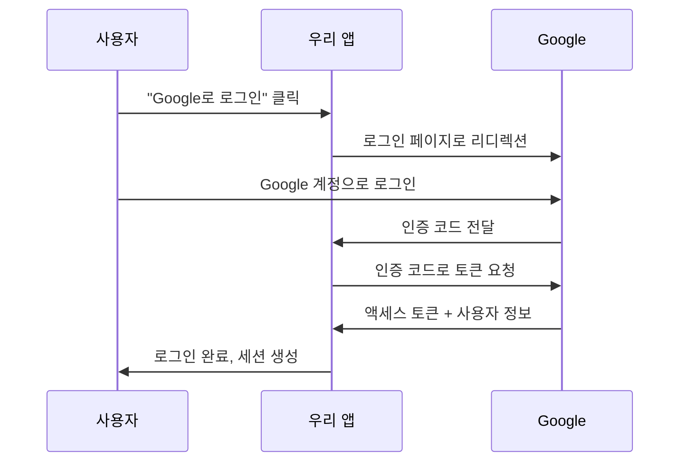

# 📚 Project 07: Social Auth Hub - React/Next.js 인증 시스템 완전 가이드

> **교육 시리즈 7/10** - React/Next.js 경험이 없는 개발자를 위한 완전한 소셜 인증 시스템 학습 가이드

---

## 📋 목차

- [🎯 학습 목표](#-학습-목표)
- [🔧 프로젝트 개요](#-프로젝트-개요)
- [📚 React/Next.js 기초 이론](#-reactnextjs-기초-이론)
- [🔐 인증 시스템 이론](#-인증-시스템-이론)
- [🛠 기술 스택 상세 분석](#-기술-스택-상세-분석)
- [📁 프로젝트 구조 분석](#-프로젝트-구조-분석)
- [🔍 핵심 코드 분석](#-핵심-코드-분석)
- [🚀 실행 가이드](#-실행-가이드)
- [🎓 학습 정리](#-학습-정리)

---

## 🎯 학습 목표

이 프로젝트를 완료하면 다음을 습득할 수 있습니다:

### 핵심 학습 목표
- **인증과 권한 관리**: 사용자 식별 및 접근 권한 제어 시스템 이해
- **세션 처리**: 사용자 로그인 상태를 안전하게 유지하는 방법 학습
- **보안 Best Practices**: 웹 애플리케이션 보안의 핵심 원칙 적용

### 구현 기술 습득
- **NextAuth.js v5 (Auth.js)**: 현대적인 인증 라이브러리 활용
- **OAuth 제공자**: Google, GitHub 등 소셜 로그인 연동
- **JWT vs Session 전략**: 두 인증 방식의 차이점과 적용 방법
- **미들웨어**: 페이지 보호 및 접근 제어 구현
- **Role-based 접근 제어**: 사용자 권한에 따른 기능 제한
- **프로필 관리**: 사용자 정보 관리 시스템 구축

---

## 🔧 프로젝트 개요

### 무엇을 만들까요?
**Social Auth Hub**는 현대적인 웹 애플리케이션에서 필수인 사용자 인증 시스템입니다. 
Google이나 GitHub 계정으로 로그인할 수 있고, 사용자별로 다른 권한을 부여할 수 있는 완전한 회원 시스템을 구축합니다.

### 주요 기능
- 🔐 **소셜 로그인**: Google, GitHub 계정으로 간편 로그인
- 👤 **프로필 관리**: 사용자 정보 조회 및 관리
- 🛡️ **권한 관리**: 일반 사용자와 관리자 구분
- 📊 **관리자 대시보드**: 전체 사용자 관리 및 통계
- 🚪 **페이지 보호**: 로그인한 사용자만 접근 가능한 페이지

---

## 📚 React/Next.js 기초 이론

React를 처음 접하는 분들을 위해 핵심 개념부터 차근차근 설명합니다.

### 1. React란 무엇인가?

**React**는 Facebook(Meta)에서 개발한 사용자 인터페이스(UI)를 만들기 위한 JavaScript 라이브러리입니다.

#### 🔑 React의 핵심 개념

**1) 컴포넌트 (Component)**
- UI를 재사용 가능한 독립적인 조각으로 나누는 개념
- 마치 레고 블록처럼 조합하여 복잡한 UI를 구성

```tsx
// src/components/Header.tsx - 헤더 컴포넌트 예시
export function Header() {
  return (
    <AppBar position="static">
      <Toolbar>
        <Typography variant="h6">
          🔐 Social Auth Hub
        </Typography>
      </Toolbar>
    </AppBar>
  );
}
```

**2) JSX (JavaScript XML)**
- JavaScript 코드 안에서 HTML과 유사한 문법을 사용
- 더 직관적이고 읽기 쉬운 코드 작성 가능

```tsx
// JSX 예시: JavaScript와 HTML이 함께
const greeting = <h1>안녕하세요, {user?.name}님!</h1>;
```

**3) Props (속성)**
- 부모 컴포넌트에서 자식 컴포넌트로 데이터를 전달하는 방법

```tsx
// src/components/Providers.tsx - Props 활용 예시
interface ProvidersProps {
  children: React.ReactNode;  // 자식 컴포넌트들
  session?: Session | null;   // 세션 정보
}

export function Providers({ children, session }: ProvidersProps) {
  return (
    <SessionProvider session={session}>
      {children}
    </SessionProvider>
  );
}
```

**4) State (상태)**
- 컴포넌트가 기억해야 하는 동적인 데이터
- 상태가 변하면 컴포넌트가 자동으로 다시 렌더링됨

```tsx
// src/components/Header.tsx - useState 훅 사용 예시
export function Header() {
  // anchorEl: 현재 상태 값
  // setAnchorEl: 상태를 변경하는 함수
  const [anchorEl, setAnchorEl] = useState<null | HTMLElement>(null);

  const handleMenuOpen = (event: React.MouseEvent<HTMLElement>) => {
    setAnchorEl(event.currentTarget); // 상태 변경
  };

  return (
    // 상태에 따라 메뉴가 열리고 닫힘
    <Menu
      anchorEl={anchorEl}
      open={Boolean(anchorEl)}
      onClose={() => setAnchorEl(null)}
    >
      {/* 메뉴 내용 */}
    </Menu>
  );
}
```

### 2. Next.js란 무엇인가?

**Next.js**는 React 기반의 풀스택 웹 애플리케이션 프레임워크입니다.
React만으로는 복잡한 웹사이트를 만들기 어려운데, Next.js가 이를 쉽게 해줍니다.

#### 🔑 Next.js의 핵심 기능

**1) App Router**
- 파일 시스템 기반 라우팅: 폴더 구조가 URL 구조가 됨

```
src/app/
├── page.tsx              → http://localhost:3000/
├── auth/signin/page.tsx  → http://localhost:3000/auth/signin
├── profile/page.tsx      → http://localhost:3000/profile
└── admin/page.tsx        → http://localhost:3000/admin
```

**2) Server Components vs Client Components**

**Server Components (서버 컴포넌트)**
- 서버에서 실행되어 HTML로 변환되어 브라우저에 전달
- 데이터베이스 조회, 파일 읽기 등 서버 작업 가능
- 기본적으로 모든 컴포넌트는 Server Component

```tsx
// src/app/page.tsx - Server Component 예시
export default async function HomePage() {
  // 서버에서 세션 정보 조회
  const session = await auth();
  
  return (
    <Container>
      {session ? (
        <Typography>안녕하세요, {session.user?.name}님!</Typography>
      ) : (
        <Typography>로그인이 필요합니다</Typography>
      )}
    </Container>
  );
}
```

**Client Components (클라이언트 컴포넌트)**
- 브라우저에서 실행되는 컴포넌트
- 사용자 상호작용(클릭, 입력 등) 처리 가능
- `"use client"` 지시어로 명시

```tsx
// src/components/Header.tsx - Client Component 예시
"use client"; // 클라이언트 컴포넌트임을 명시

export function Header() {
  // 브라우저에서 세션 상태 확인
  const { data: session, status } = useSession();
  
  // 사용자 클릭 이벤트 처리
  const handleMenuOpen = (event: React.MouseEvent<HTMLElement>) => {
    // 클릭 이벤트 처리 로직
  };

  return (
    <Button onClick={handleMenuOpen}>
      메뉴 열기
    </Button>
  );
}
```

**3) Server Actions**
- 서버에서 실행되는 함수를 클라이언트에서 직접 호출 가능
- 폼 제출, 데이터 변경 등에 활용

```tsx
// src/app/auth/signin/page.tsx - Server Action 예시
export default function SignInPage() {
  return (
    <form
      action={async () => {
        "use server"; // 서버에서 실행되는 함수임을 명시
        await signIn("google", { redirectTo: "/" });
      }}
    >
      <Button type="submit">Google로 로그인</Button>
    </form>
  );
}
```

### 3. TypeScript 기초

**TypeScript**는 JavaScript에 타입을 추가한 프로그래밍 언어입니다.
코드를 더 안전하고 예측 가능하게 만들어줍니다.

#### 🔑 TypeScript 핵심 개념

**1) 타입 정의**
```tsx
// src/types/auth.ts - 타입 정의 예시

// 인터페이스: 객체의 구조를 정의
interface ProvidersProps {
  children: React.ReactNode;    // React 컴포넌트 타입
  session?: Session | null;     // 선택적(?) 속성, null도 가능
}

// 타입 별칭: 복잡한 타입을 간단한 이름으로 정의
export interface AppUser {
  id: string;                   // 문자열 타입
  name?: string | null;         // 선택적, 문자열 또는 null
  email: string;                // 필수 문자열
  role: string;                 // 문자열 타입
  createdAt: Date;             // Date 객체 타입
}
```

**2) 제네릭 타입**
```tsx
// 다양한 타입에서 재사용 가능한 컴포넌트
interface CardProps<T> {
  data: T;                     // T는 사용할 때 결정됨
  onSelect: (item: T) => void; // T 타입을 받는 함수
}
```

---

## 🔐 인증 시스템 이론

웹 애플리케이션에서 "누가 접속했는지 알고, 그 사람이 무엇을 할 수 있는지 결정하는" 시스템입니다.

### 1. 인증 vs 인가

#### 🔍 인증 (Authentication)
**"당신이 누구인지 확인하는 과정"**

```tsx
// 로그인 과정 = 인증
const session = await auth(); // 현재 사용자가 누구인지 확인

if (session) {
  console.log(`${session.user.name}님이 로그인했습니다`);
} else {
  console.log("로그인하지 않은 사용자입니다");
}
```

#### 🛡️ 인가 (Authorization)
**"당신이 무엇을 할 수 있는지 결정하는 과정"**

```tsx
// src/app/admin/page.tsx - 권한 체크 = 인가
export default async function AdminPage() {
  const session = await auth();
  
  // 관리자 권한이 있는지 확인
  if (!session || session.user?.role !== 'ADMIN') {
    redirect('/'); // 권한이 없으면 홈으로 리디렉션
  }
  
  // 관리자만 볼 수 있는 내용
  return <AdminDashboard />;
}
```

### 2. OAuth란?

**OAuth**는 "다른 서비스의 계정을 이용해 로그인하는 표준 방식"입니다.

#### 🔄 OAuth 흐름 (Google 로그인 예시)



```tsx
// src/lib/auth.ts - OAuth 설정 예시
export const { handlers, signIn, signOut, auth } = NextAuth({
  providers: [
    Google({
      clientId: process.env.GOOGLE_CLIENT_ID!,     // Google에서 발급받은 ID
      clientSecret: process.env.GOOGLE_CLIENT_SECRET!, // Google에서 발급받은 비밀키
    }),
    GitHub({
      clientId: process.env.GITHUB_CLIENT_ID!,
      clientSecret: process.env.GITHUB_CLIENT_SECRET!,
    }),
  ],
});
```

### 3. 세션 vs JWT

사용자 로그인 상태를 유지하는 두 가지 주요 방식입니다.

#### 🍪 세션 기반 인증 (우리 프로젝트 방식)

**특징:**
- 서버에 사용자 정보 저장
- 브라우저에는 세션 ID만 저장
- 더 안전하지만 서버 메모리 사용

```tsx
// src/lib/auth.ts - 세션 기반 설정
export const { handlers, signIn, signOut, auth } = NextAuth({
  session: {
    strategy: "database", // 데이터베이스에 세션 저장
    maxAge: 30 * 24 * 60 * 60, // 30일 유지
  },
  
  callbacks: {
    async session({ session, user }) {
      // 데이터베이스에서 최신 사용자 정보 조회
      const dbUser = await prisma.user.findUnique({
        where: { id: user.id }
      });
      
      session.user.role = dbUser?.role || "USER";
      return session;
    },
  },
});
```

#### 🎟️ JWT (JSON Web Token)

**특징:**
- 토큰 자체에 사용자 정보 포함
- 서버 메모리 사용 없음
- 토큰 크기가 크고, 한번 발급되면 수정 어려움

```javascript
// JWT 토큰 예시 (실제로는 암호화됨)
{
  "sub": "user123",
  "name": "홍길동",
  "role": "USER",
  "exp": 1640995200
}
```

### 4. 미들웨어를 활용한 보호

**미들웨어**는 모든 페이지 요청을 가로채서 사전에 처리하는 기능입니다.

```tsx
// src/middleware.ts - 페이지 보호 구현
export default auth((req) => {
  const { pathname } = req.nextUrl;
  const isAuthenticated = !!req.auth;

  // 보호할 경로 정의
  const protectedPaths = ['/profile', '/admin'];
  const adminPaths = ['/admin'];

  // 관리자 페이지 접근 체크
  if (adminPaths.some(path => pathname.startsWith(path))) {
    if (!isAuthenticated) {
      // 로그인하지 않은 경우 → 로그인 페이지
      return NextResponse.redirect(new URL('/auth/signin', req.url));
    }
    
    // 관리자 권한이 없는 경우 → 홈페이지
    if (req.auth?.user?.role !== 'ADMIN') {
      return NextResponse.redirect(new URL('/', req.url));
    }
  }

  return NextResponse.next();
});
```

---

## 🛠 기술 스택 상세 분석

### 1. NextAuth.js v5 (Auth.js)

현대적인 인증 시스템의 사실상 표준 라이브러리입니다.

#### 🔧 주요 기능
- **다양한 인증 제공자 지원**: Google, GitHub, Apple, 이메일 등
- **보안 자동 처리**: CSRF, PKCE 등 보안 이슈 자동 해결
- **TypeScript 완전 지원**: 타입 안전성 보장
- **Next.js 완벽 통합**: App Router, Server Actions 완벽 지원

```tsx
// src/lib/auth.ts - NextAuth 핵심 설정
export const { handlers, signIn, signOut, auth } = NextAuth({
  adapter: PrismaAdapter(prisma), // 데이터베이스 연동
  
  providers: [
    Google({
      clientId: process.env.GOOGLE_CLIENT_ID!,
      clientSecret: process.env.GOOGLE_CLIENT_SECRET!,
    }),
  ],
  
  callbacks: {
    // 세션에 추가 정보 포함
    async session({ session, user }) {
      session.user.id = user.id;
      session.user.role = user.role;
      return session;
    },
  },
});
```

### 2. Prisma ORM

**ORM (Object-Relational Mapping)**은 데이터베이스와 객체 지향 프로그래밍 언어 간의 다리 역할을 하는 기술입니다.

#### 🗄️ 데이터베이스 스키마 정의

```prisma
// prisma/schema.prisma - 사용자 테이블 정의
model User {
  id            String    @id @default(cuid()) // 고유 ID (자동 생성)
  name          String?   // 이름 (선택사항)
  email         String    @unique // 이메일 (중복 불가)
  image         String?   // 프로필 이미지 URL
  role          String    @default("USER") // 권한 (기본값: USER)
  createdAt     DateTime  @default(now()) // 생성일시
  updatedAt     DateTime  @updatedAt // 수정일시
  
  accounts Account[] // 소셜 계정 연결 정보
  sessions Session[] // 로그인 세션 정보

  @@map("users") // 실제 테이블명
}
```

#### 🔍 데이터베이스 조회

```tsx
// src/app/admin/page.tsx - Prisma를 활용한 데이터 조회
export default async function AdminPage() {
  // 모든 사용자 조회 (최신순)
  const users = await prisma.user.findMany({
    orderBy: { createdAt: 'desc' },
    select: {
      id: true,
      name: true,
      email: true,
      role: true,
      createdAt: true,
      // 민감한 정보는 제외
    }
  });

  // 통계 계산
  const totalUsers = users.length;
  const adminUsers = users.filter(u => u.role === 'ADMIN').length;

  return <AdminDashboard users={users} stats={{ totalUsers, adminUsers }} />;
}
```

### 3. Material-UI (MUI)

Google의 Material Design을 React에서 구현한 컴포넌트 라이브러리입니다.

#### 🎨 테마 시스템

```tsx
// src/lib/theme.ts - 커스텀 테마 정의
export const theme = createTheme({
  palette: {
    primary: {
      main: '#1976d2', // 메인 색상
      light: '#42a5f5',
      dark: '#1565c0',
    },
    secondary: {
      main: '#dc004e', // 보조 색상
    },
  },
  
  // 컴포넌트별 스타일 커스터마이징
  components: {
    MuiButton: {
      styleOverrides: {
        root: {
          textTransform: 'none', // 대문자 변환 비활성화
          borderRadius: '8px',   // 모서리 둥글기
        },
      },
    },
  },
});
```

#### 🧩 컴포넌트 활용

```tsx
// src/app/page.tsx - Material-UI 컴포넌트 활용 예시
export default async function HomePage() {
  return (
    <Container maxWidth="md" sx={{ py: 4 }}>
      <Paper elevation={3} sx={{ p: 4 }}>
        <Typography variant="h3" component="h1" gutterBottom>
          🔐 Social Auth Hub
        </Typography>
        
        <Button
          variant="contained"
          size="large"
          startIcon={<Login />}
          onClick={handleLogin}
        >
          로그인 하기
        </Button>
      </Paper>
    </Container>
  );
}
```

---

## 📁 프로젝트 구조 분석

### 폴더별 역할과 설계 원칙

```
src/
├── app/                    # App Router (Next.js 13+)
│   ├── api/               # API 엔드포인트
│   ├── auth/              # 인증 관련 페이지
│   ├── admin/             # 관리자 전용 페이지
│   ├── profile/           # 사용자 프로필 페이지
│   ├── layout.tsx         # 전역 레이아웃
│   └── page.tsx           # 홈페이지
├── components/            # 재사용 가능한 컴포넌트
├── lib/                   # 유틸리티 함수 및 설정
├── types/                 # TypeScript 타입 정의
└── middleware.ts          # Next.js 미들웨어
```

#### 🏗️ 아키텍처 설계 원칙

**1) 관심사의 분리 (Separation of Concerns)**
```tsx
// ❌ 잘못된 예: 모든 기능이 한 곳에
function HomePage() {
  // 인증 로직
  const [user, setUser] = useState(null);
  
  // UI 로직
  const [isMenuOpen, setIsMenuOpen] = useState(false);
  
  // 데이터 fetching 로직
  const [users, setUsers] = useState([]);
  
  // 비즈니스 로직
  const calculateStats = () => { /* ... */ };
  
  return <div>{/* 복잡한 UI */}</div>;
}

// ✅ 올바른 예: 역할별 분리
// 인증: useSession 훅
// UI: Header 컴포넌트
// 데이터: Prisma 쿼리
// 비즈니스 로직: 별도 함수
```

**2) 단일 책임 원칙 (Single Responsibility Principle)**
```tsx
// src/components/Header.tsx - 헤더만 담당
export function Header() {
  return <AppBar>헤더 내용</AppBar>;
}

// src/components/Providers.tsx - 프로바이더만 담당
export function Providers({ children }) {
  return <SessionProvider>{children}</SessionProvider>;
}

// src/components/ThemeRegistry.tsx - 테마만 담당
export function ThemeRegistry({ children }) {
  return <ThemeProvider>{children}</ThemeProvider>;
}
```

### App Router vs Pages Router

**App Router** (Next.js 13+ 권장 방식)을 사용하는 이유:

#### 🔄 라우팅 방식 비교

```
📁 App Router (현재 프로젝트)
src/app/
├── page.tsx                    → /
├── auth/signin/page.tsx        → /auth/signin
├── profile/page.tsx            → /profile
└── admin/page.tsx              → /admin

📁 Pages Router (구버전)
pages/
├── index.tsx                   → /
├── auth/signin.tsx             → /auth/signin
├── profile.tsx                 → /profile
└── admin.tsx                   → /admin
```

#### ⚡ App Router의 장점

**1) Server Components 기본 지원**
```tsx
// App Router에서는 기본적으로 서버에서 실행
export default async function ProfilePage() {
  // 서버에서 직접 데이터베이스 조회 가능
  const session = await auth();
  const user = await prisma.user.findUnique({
    where: { id: session.user.id }
  });
  
  return <UserProfile user={user} />;
}
```

**2) 레이아웃 공유**
```tsx
// src/app/layout.tsx - 모든 페이지에 적용
export default function RootLayout({ children }) {
  return (
    <html>
      <body>
        <Header />        {/* 모든 페이지에 공통 헤더 */}
        {children}        {/* 페이지별 내용 */}
        <Footer />        {/* 모든 페이지에 공통 푸터 */}
      </body>
    </html>
  );
}
```

---

## 🔍 핵심 코드 분석

### 1. 인증 플로우 구현

#### 🔑 NextAuth 설정의 핵심

```tsx
// src/lib/auth.ts - 인증 시스템의 심장부
export const { handlers, signIn, signOut, auth } = NextAuth({
  // 1. 데이터베이스 연동 어댑터
  adapter: PrismaAdapter(prisma),
  
  // 2. OAuth 제공자 설정
  providers: [
    Google({
      clientId: process.env.GOOGLE_CLIENT_ID!,
      clientSecret: process.env.GOOGLE_CLIENT_SECRET!,
    }),
    GitHub({
      clientId: process.env.GITHUB_CLIENT_ID!,
      clientSecret: process.env.GITHUB_CLIENT_SECRET!,
    }),
  ],
  
  // 3. 세션 전략 설정
  session: {
    strategy: "database", // 세션을 DB에 저장
    maxAge: 30 * 24 * 60 * 60, // 30일간 유지
  },
  
  // 4. 콜백 함수 - 인증 과정에서 실행되는 함수들
  callbacks: {
    // 세션 데이터 커스터마이징
    async session({ session, user }) {
      if (session?.user) {
        session.user.id = user.id;
        
        // 최신 사용자 정보 조회 (역할 포함)
        const dbUser = await prisma.user.findUnique({
          where: { id: user.id }
        });
        
        session.user.role = dbUser?.role || "USER";
      }
      return session;
    },
  },
});
```

#### 📝 각 부분의 역할 설명

**1) Adapter (어댑터)**
- NextAuth와 데이터베이스를 연결하는 다리
- 사용자 정보, 세션, 계정 연결 정보를 DB에 저장/조회

**2) Providers (제공자)**
- 로그인 방식을 정의 (Google, GitHub 등)
- 각 제공자별로 클라이언트 ID와 시크릿 필요

**3) Session Strategy (세션 전략)**
- `"database"`: 세션 정보를 DB에 저장 (더 안전)
- `"jwt"`: 세션 정보를 JWT 토큰에 저장 (서버 부담 적음)

**4) Callbacks (콜백)**
- 인증 과정에서 실행되는 커스텀 함수들
- 세션 데이터 가공, 추가 검증 등 수행

### 2. 서버 컴포넌트에서의 인증 체크

```tsx
// src/app/admin/page.tsx - 서버에서 권한 체크
export default async function AdminPage() {
  // 1. 서버에서 현재 세션 확인
  const session = await auth();
  
  // 2. 권한 체크 및 리디렉션
  if (!session || session.user?.role !== 'ADMIN') {
    redirect('/'); // Next.js 함수로 즉시 리디렉션
  }
  
  // 3. 권한이 있는 경우에만 데이터 조회
  const users = await prisma.user.findMany({
    orderBy: { createdAt: 'desc' }
  });
  
  // 4. JSX 반환 (이 시점에서는 권한이 확인된 상태)
  return (
    <Container>
      <Typography variant="h4">관리자 대시보드</Typography>
      <UserTable users={users} />
    </Container>
  );
}
```

### 3. 클라이언트 컴포넌트에서의 인증 처리

```tsx
// src/components/Header.tsx - 클라이언트에서 실시간 상태 관리
"use client";

export function Header() {
  // 1. 클라이언트에서 세션 상태 구독
  const { data: session, status } = useSession();
  
  // 2. 로딩 상태 처리
  if (status === "loading") {
    return <CircularProgress />;
  }
  
  // 3. 로그인 상태에 따른 UI 분기
  return (
    <AppBar>
      <Toolbar>
        <Typography variant="h6">Social Auth Hub</Typography>
        
        {session ? (
          // 로그인한 경우
          <>
            <Avatar src={session.user?.image} />
            <Button onClick={() => signOut()}>로그아웃</Button>
          </>
        ) : (
          // 로그인하지 않은 경우
          <Button href="/auth/signin">로그인</Button>
        )}
      </Toolbar>
    </AppBar>
  );
}
```

### 4. 미들웨어를 통한 전역 보안

```tsx
// src/middleware.ts - 모든 요청을 가로채는 보안 계층
export default auth((req) => {
  const { pathname } = req.nextUrl;
  const isAuthenticated = !!req.auth;
  const userRole = req.auth?.user?.role;

  // 1. 경로별 접근 규칙 정의
  const routes = {
    public: ['/', '/auth/signin'],           // 누구나 접근 가능
    protected: ['/profile'],                 // 로그인 필요
    admin: ['/admin']                        // 관리자만 접근 가능
  };

  // 2. 관리자 전용 페이지 체크
  if (routes.admin.some(path => pathname.startsWith(path))) {
    if (!isAuthenticated) {
      return NextResponse.redirect(new URL('/auth/signin', req.url));
    }
    
    if (userRole !== 'ADMIN') {
      return NextResponse.redirect(new URL('/', req.url));
    }
  }

  // 3. 일반 보호 페이지 체크
  if (routes.protected.some(path => pathname.startsWith(path))) {
    if (!isAuthenticated) {
      return NextResponse.redirect(new URL('/auth/signin', req.url));
    }
  }

  // 4. 로그인한 사용자가 로그인 페이지 접근 시
  if (pathname === '/auth/signin' && isAuthenticated) {
    return NextResponse.redirect(new URL('/', req.url));
  }

  // 5. 모든 조건을 통과하면 요청 계속 진행
  return NextResponse.next();
});
```

### 5. Server Actions 활용

**Server Actions**는 클라이언트에서 서버 함수를 직접 호출할 수 있게 해주는 Next.js 15의 혁신적 기능입니다.

```tsx
// src/app/auth/signin/page.tsx - Server Action으로 로그인 처리
export default function SignInPage() {
  return (
    <form
      action={async () => {
        "use server"; // 이 함수는 서버에서 실행됨을 명시
        
        // 서버에서 실행되는 로그인 로직
        await signIn("google", { 
          redirectTo: "/" 
        });
      }}
    >
      <Button type="submit">Google로 로그인</Button>
    </form>
  );
}
```

#### 🔄 Server Actions의 장점

**1) 전통적인 방식 (복잡함)**
```tsx
// 클라이언트 컴포넌트
function LoginForm() {
  const handleSubmit = async (e) => {
    e.preventDefault();
    
    // API 호출
    const response = await fetch('/api/login', {
      method: 'POST',
      headers: { 'Content-Type': 'application/json' },
      body: JSON.stringify({ provider: 'google' })
    });
    
    if (response.ok) {
      router.push('/');
    }
  };

  return (
    <form onSubmit={handleSubmit}>
      <button type="submit">로그인</button>
    </form>
  );
}

// API 라우트 파일 (pages/api/login.ts)
export default async function handler(req, res) {
  if (req.method === 'POST') {
    // 로그인 로직
    await signIn(req.body.provider);
    res.json({ success: true });
  }
}
```

**2) Server Actions 방식 (간단함)**
```tsx
// 모든 로직이 한 곳에
export default function SignInPage() {
  return (
    <form
      action={async () => {
        "use server";
        await signIn("google", { redirectTo: "/" });
      }}
    >
      <button type="submit">로그인</button>
    </form>
  );
}
```

---

## 🚀 실행 가이드

### 단계별 실행 방법

#### 1단계: 개발 환경 설정

```bash
# Node.js 18+ 버전 확인
node --version

# 프로젝트 생성 및 이동
npx create-next-app@latest social-auth-hub
cd social-auth-hub

# 의존성 설치
npm install
```

#### 2단계: 환경 변수 설정

`.env.local` 파일을 생성하고 다음 내용을 추가:

```env
# NextAuth.js 설정
AUTH_SECRET=your-super-secret-key-change-this-to-32-characters-minimum
NEXTAUTH_URL=http://localhost:3000

# 데이터베이스
DATABASE_URL="file:./dev.db"

# Google OAuth (설정 방법은 아래 참조)
GOOGLE_CLIENT_ID=your-google-client-id
GOOGLE_CLIENT_SECRET=your-google-client-secret

# GitHub OAuth (설정 방법은 아래 참조)
GITHUB_CLIENT_ID=your-github-client-id
GITHUB_CLIENT_SECRET=your-github-client-secret
```

#### 3단계: OAuth 애플리케이션 설정

**🔗 Google OAuth 설정 상세 가이드**

1. [Google Cloud Console](https://console.cloud.google.com/) 접속
2. 프로젝트 선택 또는 새로 생성
3. 좌측 메뉴에서 "APIs & Services" > "Credentials" 선택
4. "Create Credentials" > "OAuth 2.0 Client ID" 클릭
5. Application type: "Web application" 선택
6. Name: "Social Auth Hub" (또는 원하는 이름)
7. Authorized JavaScript origins:
   ```
   http://localhost:3000
   ```
8. Authorized redirect URIs:
   ```
   http://localhost:3000/api/auth/callback/google
   ```
9. "Create" 버튼 클릭
10. 생성된 Client ID와 Client Secret을 복사하여 `.env.local`에 저장

**🔗 GitHub OAuth 설정 상세 가이드**

1. [GitHub](https://github.com/) 로그인 후 Settings 이동
2. 좌측 메뉴에서 "Developer settings" 클릭
3. "OAuth Apps" > "New OAuth App" 클릭
4. 다음 정보 입력:
   - Application name: `Social Auth Hub`
   - Homepage URL: `http://localhost:3000`
   - Application description: `Next.js 소셜 인증 시스템`
   - Authorization callback URL: `http://localhost:3000/api/auth/callback/github`
5. "Register application" 클릭
6. 생성된 Client ID 복사
7. "Generate a new client secret" 클릭하여 Client Secret 생성
8. 두 값을 `.env.local`에 저장

#### 4단계: 데이터베이스 초기화

```bash
# Prisma 마이그레이션 실행 (테이블 생성)
npx prisma migrate dev --name init

# Prisma 클라이언트 생성
npx prisma generate

# (선택사항) 데이터베이스 시각적 관리 도구
npx prisma studio
```

#### 5단계: 개발 서버 실행

```bash
# 개발 서버 시작
npm run dev

# 브라우저에서 확인
# http://localhost:3000
```

### 실행 후 테스트 시나리오

#### 🧪 기본 기능 테스트

1. **홈페이지 접속**
   - `http://localhost:3000` 접속
   - "로그인이 필요합니다" 메시지 확인

2. **소셜 로그인 테스트**
   - "로그인 하기" 버튼 클릭
   - Google 또는 GitHub 계정으로 로그인
   - 홈페이지로 리디렉션 확인

3. **프로필 페이지 테스트**
   - 헤더에서 프로필 아이콘 클릭
   - 프로필 페이지 접속 확인
   - 사용자 정보 표시 확인

4. **권한 시스템 테스트**
   - `/admin` 페이지 직접 접속 시도
   - 일반 사용자는 홈페이지로 리디렉션 확인

5. **관리자 권한 부여 및 테스트**
   ```bash
   # Prisma Studio 실행
   npx prisma studio
   
   # 브라우저에서 http://localhost:5555 접속
   # User 테이블에서 본인 계정의 role을 'ADMIN'으로 변경
   ```
   - 브라우저 새로고침 후 관리자 대시보드 접근 확인

#### 🔍 디버깅 팁

**문제: OAuth 로그인이 안될 때**
```
해결방법:
1. .env.local 파일의 CLIENT_ID, CLIENT_SECRET 확인
2. OAuth 콘솔에서 redirect URI 정확히 입력했는지 확인
3. 개발자 도구 Network 탭에서 에러 메시지 확인
```

**문제: 데이터베이스 연결 오류**
```
해결방법:
1. npx prisma migrate dev 재실행
2. DATABASE_URL 경로 확인
3. npx prisma generate 재실행
```

**문제: 세션이 유지되지 않을 때**
```
해결방법:
1. AUTH_SECRET 값이 32자 이상인지 확인
2. 브라우저 캐시 및 쿠키 삭제
3. 개발자 도구 Application 탭에서 쿠키 확인
```

---

## 🎓 학습 정리

### 핵심 개념 정리

#### 1. React/Next.js 아키텍처 이해

**컴포넌트 기반 아키텍처**
```tsx
// 작은 단위의 재사용 가능한 컴포넌트들
<App>
  <ThemeProvider>
    <SessionProvider>
      <Header />
      <MainContent />
      <Footer />
    </SessionProvider>
  </ThemeProvider>
</App>
```

**Server vs Client Components 구분**
```tsx
// Server Component (기본)
async function ServerPage() {
  const data = await fetchData(); // 서버에서 실행
  return <div>{data}</div>;
}

// Client Component
"use client";
function ClientComponent() {
  const [state, setState] = useState(); // 브라우저에서 실행
  return <button onClick={() => setState()}>클릭</button>;
}
```

#### 2. 현대적인 인증 시스템

**OAuth 흐름 이해**
1. 사용자가 "Google로 로그인" 클릭
2. Google 로그인 페이지로 리디렉션
3. Google에서 인증 후 우리 앱으로 코드 전달
4. 코드를 토큰으로 교환하여 사용자 정보 획득
5. 우리 DB에 사용자 정보 저장 및 세션 생성

**권한 기반 접근 제어**
```tsx
// 3단계 보안 체크
1. 미들웨어: 페이지 접근 전 사전 검증
2. 서버 컴포넌트: 페이지 로딩 시 권한 검증  
3. 클라이언트 컴포넌트: UI 상태에 따른 동적 제어
```

#### 3. 타입 안전한 개발

**TypeScript의 이점**
```tsx
// 컴파일 시점에 에러 발견
interface User {
  id: string;
  name: string;
  role: 'USER' | 'ADMIN'; // 정확한 값만 허용
}

function getUser(): User {
  return {
    id: "123",
    name: "홍길동",
    role: "SUPER_ADMIN" // ❌ TypeScript 에러!
  };
}
```

### 실무 적용 포인트

#### 🔐 보안 Best Practices

1. **환경 변수 관리**
   ```bash
   # ✅ 올바른 방법
   AUTH_SECRET=강력한32자이상의랜덤문자열
   
   # ❌ 잘못된 방법  
   AUTH_SECRET=123456
   ```

2. **HTTPS 사용** (프로덕션)
   ```env
   NEXTAUTH_URL=https://your-domain.com
   ```

3. **CSRF 보호** (NextAuth에서 자동 처리)

4. **Rate Limiting** (향후 구현 예정)

#### 🎯 성능 최적화

1. **Server Components 활용**
   ```tsx
   // 서버에서 미리 데이터 로딩
   async function UserPage() {
     const users = await prisma.user.findMany(); // 서버에서 실행
     return <UserList users={users} />; // HTML로 전송
   }
   ```

2. **Static Generation 활용**
   ```tsx
   // 빌드 시점에 페이지 생성
   export async function generateStaticParams() {
     return [{ id: '1' }, { id: '2' }];
   }
   ```

### 다음 단계 학습 방향

#### 🚀 중급 기능 구현

1. **이메일 인증 추가**
   ```tsx
   // 이메일 제공자 추가
   Email({
     server: process.env.EMAIL_SERVER,
     from: process.env.EMAIL_FROM
   })
   ```

2. **다중 계정 연결**
   ```tsx
   // 한 사용자가 Google + GitHub 동시 연결
   const accounts = await prisma.account.findMany({
     where: { userId: session.user.id }
   });
   ```

3. **실시간 알림 시스템**
   ```tsx
   // WebSocket 또는 Server-Sent Events 활용
   useEffect(() => {
     const eventSource = new EventSource('/api/notifications');
     eventSource.onmessage = (event) => {
       // 실시간 알림 처리
     };
   }, []);
   ```

#### 📊 고급 기능 확장

1. **사용자 활동 로그**
   ```prisma
   model ActivityLog {
     id        String   @id @default(cuid())
     userId    String
     action    String   // "LOGIN", "LOGOUT", "VIEW_PAGE"
     metadata  Json?    // 추가 정보
     createdAt DateTime @default(now())
     
     user User @relation(fields: [userId], references: [id])
   }
   ```

2. **2단계 인증 (2FA)**
   ```tsx
   // TOTP (Time-based One-Time Password) 구현
   import { authenticator } from 'otplib';
   
   const secret = authenticator.generateSecret();
   const token = authenticator.generate(secret);
   ```

3. **소셜 프로필 동기화**
   ```tsx
   // 주기적으로 소셜 프로필 정보 업데이트
   const refreshProfile = async () => {
     const freshProfile = await fetchGoogleProfile(accessToken);
     await prisma.user.update({
       where: { id: userId },
       data: { name: freshProfile.name, image: freshProfile.picture }
     });
   };
   ```

### 💡 실무 개발 팁

#### 1. 코드 품질 관리

```tsx
// ESLint 규칙 점진적 적용
{
  "rules": {
    "@typescript-eslint/no-unused-vars": "warn", // 처음엔 경고
    "@typescript-eslint/no-unused-vars": "error" // 나중에 에러로 변경
  }
}
```

#### 2. 테스트 전략

```tsx
// 단위 테스트 예시
describe('Auth Helper', () => {
  test('should return user role', () => {
    const user = { role: 'ADMIN' };
    expect(getUserRole(user)).toBe('ADMIN');
  });
});

// 통합 테스트 예시  
describe('Login Flow', () => {
  test('should redirect after Google login', async () => {
    // 로그인 플로우 전체 테스트
  });
});
```

#### 3. 배포 전 체크리스트

```bash
# ✅ 프로덕션 준비 체크리스트
1. 환경 변수 production 값으로 변경
2. OAuth redirect URL production 도메인으로 변경  
3. AUTH_SECRET 강력한 값으로 변경
4. 데이터베이스 PostgreSQL 등으로 변경
5. HTTPS 적용
6. 에러 모니터링 도구 설정 (Sentry 등)
```

---

## 🏆 프로젝트 완료 후 성취

이 프로젝트를 완료하신 것을 축하합니다! 🎉

### ✅ 습득한 핵심 기술

1. **React 19 + Next.js 15 마스터**
   - Server Components와 Client Components 구분
   - App Router 기반 라우팅 시스템
   - Server Actions를 활용한 폼 처리

2. **현대적인 인증 시스템 구축**
   - OAuth 2.0 프로토콜 이해 및 구현
   - 세션 기반 인증 vs JWT 차이점 학습
   - 보안 Best Practices 적용

3. **TypeScript 활용 개발**
   - 타입 안전한 API 설계
   - 인터페이스와 제네릭 활용
   - 컴파일 타임 에러 방지

4. **데이터베이스 연동**
   - Prisma ORM 활용한 타입 안전 쿼리
   - 관계형 데이터 모델링
   - 마이그레이션 관리

5. **UI/UX 설계**
   - Material-UI 컴포넌트 시스템 활용
   - 반응형 디자인 구현
   - 사용자 친화적 인터페이스 설계

### 🎯 다음 프로젝트 준비

**Project 08 예고**: 실시간 채팅 시스템
- WebSocket 통신
- 실시간 메시징
- 채팅방 관리
- 파일 업로드

이 프로젝트에서 학습한 인증 시스템이 다음 프로젝트의 기반이 됩니다!

---

**🎓 학습을 마치며...**

복잡해 보였던 소셜 로그인 시스템을 직접 구축해보셨습니다. 
이제 여러분은 현대적인 웹 애플리케이션의 핵심 기능인 사용자 인증을 완전히 이해하고 구현할 수 있습니다.

계속해서 더 고급 기능들을 추가해보시고, 다음 프로젝트에서 더 흥미로운 기술들을 함께 학습해나가겠습니다!

**Happy Coding! 🚀**